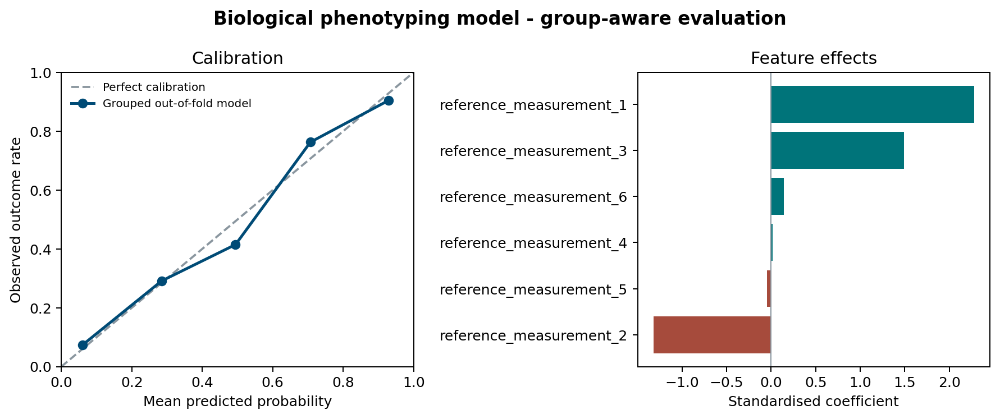

# Machine learning for biological phenotyping

This repository is an independent, reproducible demonstration of a grouped
classification workflow for biological phenotyping. It connects synthetic
reference measurements with a binary phenotype outcome while keeping
experimental batches together during validation.



## What this demonstrates

- Translating biological sampling structure into a defensible validation plan.
- Preventing batch leakage with group-aware cross-validation.
- Evaluating discrimination and probability quality rather than accuracy alone.
- Producing interpretable feature summaries and reusable analysis outputs.
- Separating a public portfolio demonstration from confidential employer data.

## Why this example exists

Biological datasets often contain repeated measurements, batches, accessions,
or experimental sessions. Randomly splitting individual rows can leak related
observations across training and test sets and make performance look better
than it really is. This example uses group-aware cross-validation to evaluate
generalisation to unseen experimental batches.

## Workflow

1. Generate a deterministic synthetic dataset with six reference measurements,
   a batch identifier, and a phenotype outcome.
2. Build a standardised logistic-regression classifier.
3. Produce out-of-fold predictions with `GroupKFold`.
4. Report ROC-AUC and Brier score.
5. Summarise calibration and model coefficients for interpretation.
6. Export a publication-ready summary figure.

## Run

```bash
python -m venv .venv
source .venv/bin/activate
pip install -r requirements.txt
python analysis.py
python -m unittest -v
```

The script writes the following deterministic outputs to `outputs/`:

- `metrics.json`: ROC-AUC, Brier score, sample count, and batch count.
- `calibration.csv`: observed and predicted outcome rates by probability bin.
- `feature_coefficients.csv`: standardised logistic-regression coefficients.
- `phenotyping_model_summary.png`: calibration and feature-effect overview.
- `synthetic_phenotypes.csv`: generated demonstration dataset.

## Interpretation

The example asks whether a model can generalise to entirely unseen experimental
batches. Grouped out-of-fold predictions provide the primary evaluation. The
calibration panel checks whether predicted probabilities match observed outcome
rates, while the coefficient panel provides a compact view of the strongest
modelled feature effects. These results are illustrative rather than biological
findings because all measurements and outcomes are generated synthetically.

## Project structure

```text
analysis.py          Reproducible data generation, modelling, evaluation, and figures
test_analysis.py     Regression tests for determinism, structure, and calibration
requirements.txt     Pinned Python dependencies
outputs/             Deterministic data, metrics, tables, and figure
```

## Confidentiality boundary

This is a clean, independently created demonstration. The dataset is generated
entirely in code and does not reproduce or derive from any employer dataset,
source code, protocol, experimental design, unpublished result, client
information, or commercial detail.

## Author

Gonzalo Villarino, PhD  
https://gonzalovillarino.com/
